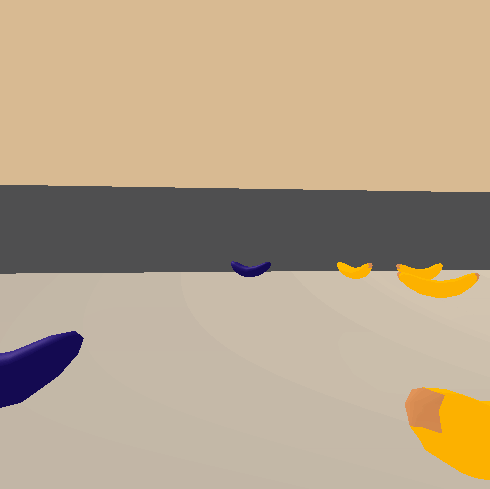

## Introduction
This project is being done as part of the [Udacity Deep Reinforcement Learning Nanodegree](https://www.udacity.com/course/deep-reinforcement-learning-nanodegree--nd893), a four month course that I am enrolled in.

We will use reinforcement learning to train an agent inside a [Unity-ML](https://github.com/Unity-Technologies/ml-agents) environment.  We will be working in an environment similar to the [Banana Collector](https://github.com/Unity-Technologies/ml-agents/blob/master/docs/Learning-Environment-Examples.md#banana-collector), however this will be a simplified version using a single agent, a smaller state space and a discrete action space.  This will make it an ideal candidate to leverage a Deep Q Network (DQN).


## Environment Description
The environment is a open 3D space that the agent will need to navigate.  The goal is to collect as many good (yellow) bananas as possible while avoiding bad (blue) ones.  A reward of +1 is provided for collecting a yellow banana, and a reward of -1 is provided for collecting a blue banana.

The state space has 37 dimensions and contains the agent's velocity, along with ray-based perception of objects around the agent's forward direction. Given this information, the agent has to learn how to best select actions. Four discrete actions are available, corresponding to:

- 0 - move forward.
- 1 - move backward.
- 2 - turn left.
- 3 - turn right.

The task is episodic, and in order to solve the environment, the agent must get an average score of +13 over 100 consecutive episodes.

Here's an example of a single observation of the environment:



## Installation

#### Pre-requisites
- Make sure you having a working version of [Anaconda](https://www.anaconda.com/download/) on your system.


### Step 1: Clone the repo
Clone this repo using `git clone https://github.com/danielnbarbosa/drlnd_navigation.git`.


#### Step 2: Install Dependencies
Create an anaconda environment that contains all the required dependencies to run the project.

Mac:
```
conda create --name drlnd_navigation python=3.6
source activate drlnd_navigation
conda install -y python.app
conda install -y pytorch -c pytorch
pip install torchsummary unityagents
```

Windows:
```
conda create --name drlnd_navigation python=3.6
activate drlnd_navigation
conda install -y pytorch -c pytorch
pip install torchsummary unityagents
```

#### Step 3: Download Banana environment
You will also need to install the pre-built Unity environment, you will NOT need to install Unity itself.  Select the appropriate file for your operating system:

- Linux: click [here](https://s3-us-west-1.amazonaws.com/udacity-drlnd/P1/Banana/Banana_Linux.zip)
- Mac OSX: click [here](https://s3-us-west-1.amazonaws.com/udacity-drlnd/P1/Banana/Banana.app.zip)
- Windows (32-bit): click [here](https://s3-us-west-1.amazonaws.com/udacity-drlnd/P1/Banana/Banana_Windows_x86.zip)
- Windows (64-bit): click [here](https://s3-us-west-1.amazonaws.com/udacity-drlnd/P1/Banana/Banana_Windows_x86_64.zip)

Download the file into the top level directory of this repo and unzip it.


## Train your agent
To train the agent run `python bananas.py`.  This will fire up the Unity environment and output live training statistics to the command line.  When training is finished you'll have a saved model in `checkpoints/solved.pth` and see some graphs that help visualize the agent's learning progress.  It should take the agent around 150 - 250 episodes to solve the environment.

To watch your trained agent interact with the environment run `python bananas.py --render`.  This will load the saved weights from a checkpoint file.  A previously trained model is included in this repo.

Mac users may need to execute python using `pythonw` instead of `python` due to matplotlib requiring a framework build of python.  More details [here](https://matplotlib.org/faq/osx_framework.html).

Feel to experiment with modifying the hyperparameters to see how it affects training.

## Report
See the [report](results/Report.md) for more insight on how I arrived at the current hyperparameters.  
